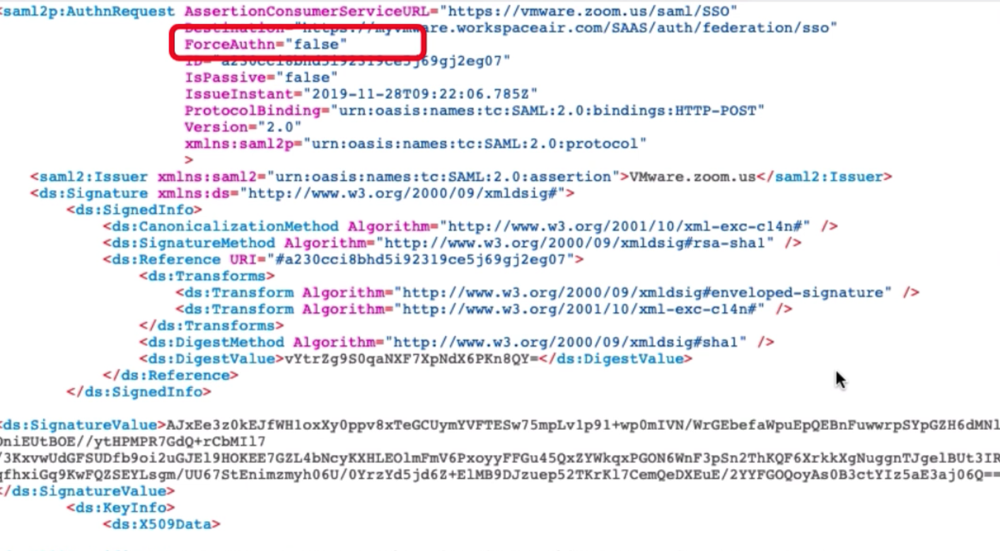
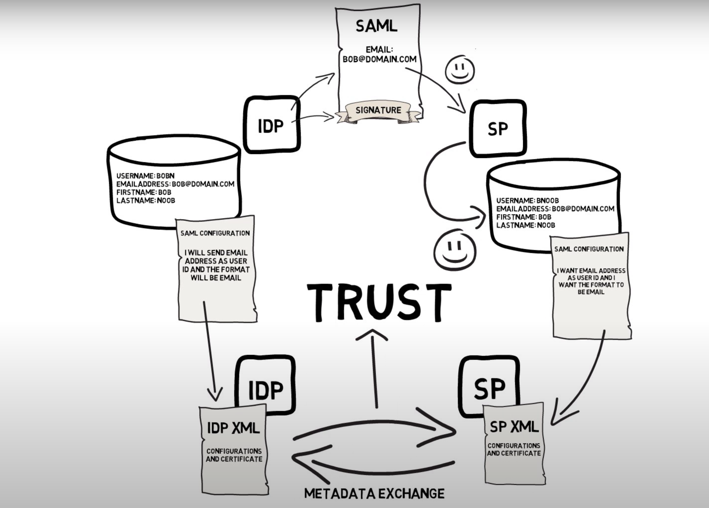
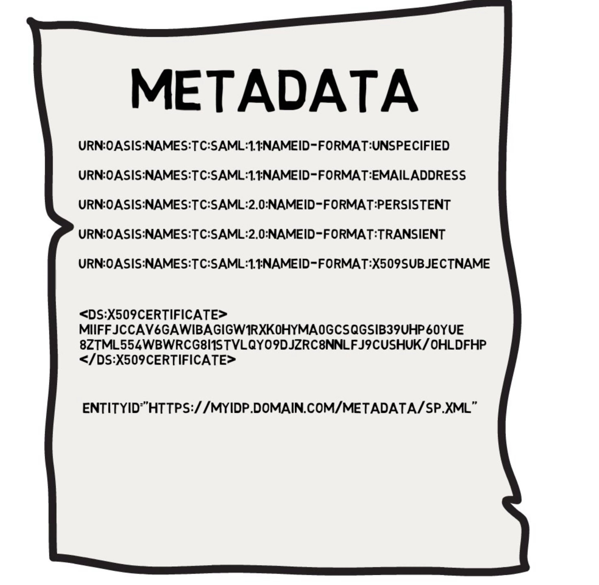
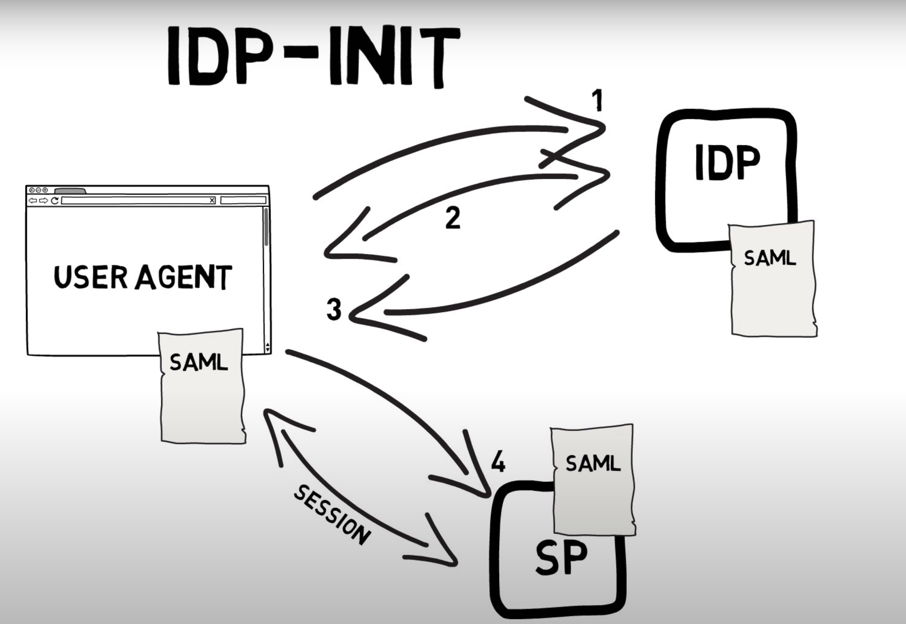
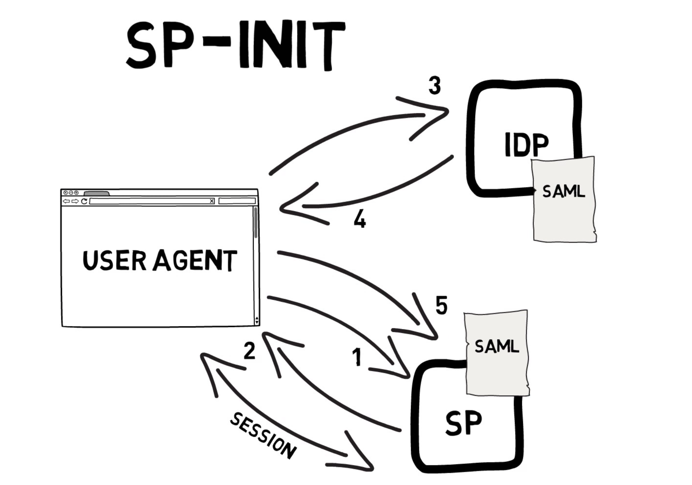
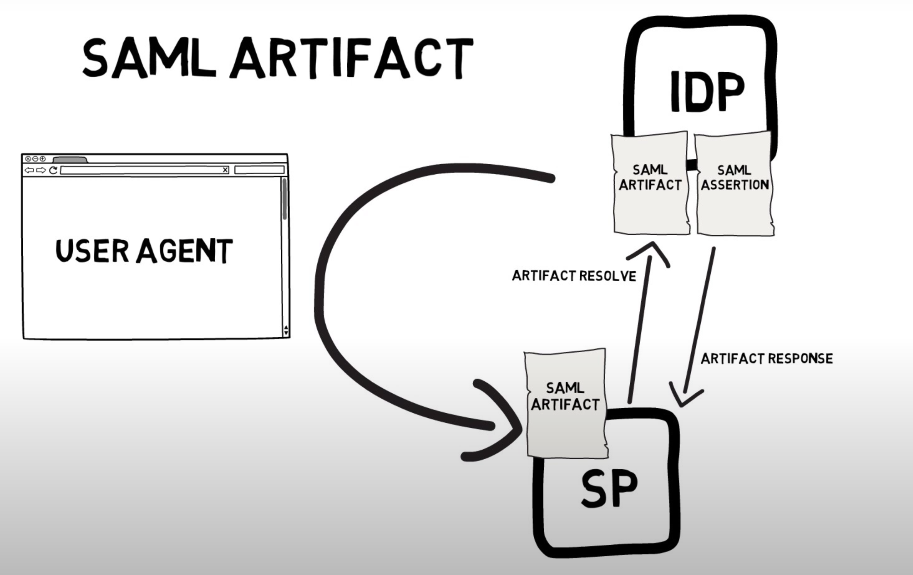
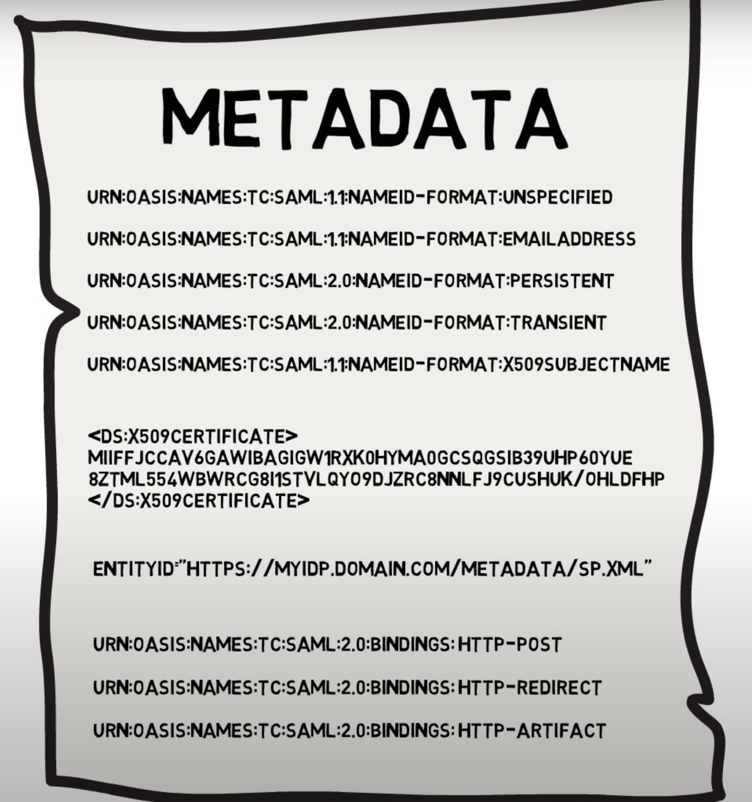
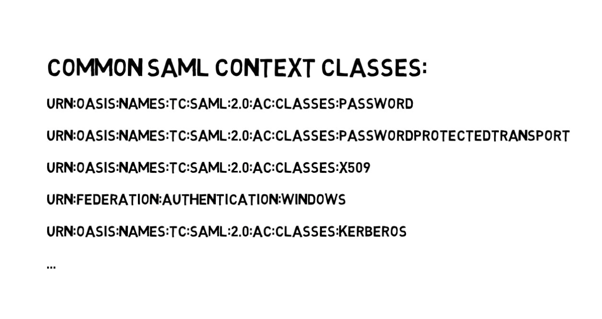

# SAML notes

## SSO with Marketing Cloud example


-[Refer: MC Enable Single Sign-On Authentication Via SAML 2.0](https://mohan-chinnappan-n2.github.io/2020/mc/sso/mc-sso.html)


### AuthNRequest HTTP redirect

### AuthNRequest  HTTP Post


##  AuthNRequest
-  Sent by the SP to the IdP
- Two ways
    - An AuthnRequest with its Signature **(HTTP-Redirect binding)**.
    - An AuthNRequest with the signature embedded **(HTTP-POST binding)**.

### Sample  AuthNRequest with embedded signature (HTTP-POST binding)
```xml
<samlp:AuthnRequest xmlns:samlp="urn:oasis:names:tc:SAML:2.0:protocol" xmlns:saml="urn:oasis:names:tc:SAML:2.0:assertion" ID="pfx41d8ef22-e612-8c50-9960-1b16f15741b3" Version="2.0" ProviderName="SP test" IssueInstant="2014-07-16T23:52:45Z" Destination="http://idp.example.com/SSOService.php" ProtocolBinding="urn:oasis:names:tc:SAML:2.0:bindings:HTTP-POST" AssertionConsumerServiceURL="http://sp.example.com/demo1/index.php?acs">
  <saml:Issuer>http://sp.example.com/demo1/metadata.php</saml:Issuer>
  <ds:Signature xmlns:ds="http://www.w3.org/2000/09/xmldsig#">
    <ds:SignedInfo>
      <ds:CanonicalizationMethod Algorithm="http://www.w3.org/2001/10/xml-exc-c14n#"/>
      <ds:SignatureMethod Algorithm="http://www.w3.org/2000/09/xmldsig#rsa-sha1"/>
      <ds:Reference URI="#pfx41d8ef22-e612-8c50-9960-1b16f15741b3">
        <ds:Transforms>
          <ds:Transform Algorithm="http://www.w3.org/2000/09/xmldsig#enveloped-signature"/>
          <ds:Transform Algorithm="http://www.w3.org/2001/10/xml-exc-c14n#"/>
        </ds:Transforms>
        <ds:DigestMethod Algorithm="http://www.w3.org/2000/09/xmldsig#sha1"/>
        <ds:DigestValue>yJN6cXUwQxTmMEsPesBP2NkqYFI=</ds:DigestValue>
      </ds:Reference>
    </ds:SignedInfo>
    <ds:SignatureValue>g5eM9yPnKsmmE/Kh2qS7nfK8HoF6yHrAdNQxh70kh8pRI4KaNbYNOL9sF8F57Yd+jO6iNga8nnbwhbATKGXIZOJJSugXGAMRyZsj/rqngwTJk5KmujbqouR1SLFsbo7Iuwze933EgefBbAE4JRI7V2aD9YgmB3socPqAi2Qf97E=</ds:SignatureValue>
    <ds:KeyInfo>
      <ds:X509Data>
        <ds:X509Certificate>MIICajCCAdOgAwIBAgIBADANBgkqhkiG9w0BAQQFADBSMQswCQYDVQQGEwJ1czETMBEGA1UECAwKQ2FsaWZvcm5pYTEVMBMGA1UECgwMT25lbG9naW4gSW5jMRcwFQYDVQQDDA5zcC5leGFtcGxlLmNvbTAeFw0xNDA3MTcwMDI5MjdaFw0xNTA3MTcwMDI5MjdaMFIxCzAJBgNVBAYTAnVzMRMwEQYDVQQIDApDYWxpZm9ybmlhMRUwEwYDVQQKDAxPbmVsb2dpbiBJbmMxFzAVBgNVBAMMDnNwLmV4YW1wbGUuY29tMIGfMA0GCSqGSIb3DQEBAQUAA4GNADCBiQKBgQC7vU/6R/OBA6BKsZH4L2bIQ2cqBO7/aMfPjUPJPSn59d/f0aRqSC58YYrPuQODydUABiCknOn9yV0fEYm4bNvfjroTEd8bDlqo5oAXAUAI8XHPppJNz7pxbhZW0u35q45PJzGM9nCv9bglDQYJLby1ZUdHsSiDIpMbGgf/ZrxqawIDAQABo1AwTjAdBgNVHQ4EFgQU3s2NEpYx7wH6bq7xJFKa46jBDf4wHwYDVR0jBBgwFoAU3s2NEpYx7wH6bq7xJFKa46jBDf4wDAYDVR0TBAUwAwEB/zANBgkqhkiG9w0BAQQFAAOBgQCPsNO2FG+zmk5miXEswAs30E14rBJpe/64FBpM1rPzOleexvMgZlr0/smF3P5TWb7H8Fy5kEiByxMjaQmml/nQx6qgVVzdhaTANpIE1ywEzVJlhdvw4hmRuEKYqTaFMLez0sRL79LUeDxPWw7Mj9FkpRYT+kAGiFomHop1nErV6Q==</ds:X509Certificate>
      </ds:X509Data>
    </ds:KeyInfo>
  </ds:Signature>
  <samlp:NameIDPolicy Format="urn:oasis:names:tc:SAML:1.1:nameid-format:emailAddress" AllowCreate="true"/>
  <samlp:RequestedAuthnContext Comparison="exact">
    <saml:AuthnContextClassRef>urn:oasis:names:tc:SAML:2.0:ac:classes:PasswordProtectedTransport</saml:AuthnContextClassRef>
  </samlp:RequestedAuthnContext>
</samlp:AuthnRequest>

```


### Sample AuthnRequest

```xml

<samlp:AuthnRequest xmlns:samlp="urn:oasis:names:tc:SAML:2.0:protocol" xmlns:saml="urn:oasis:names:tc:SAML:2.0:assertion" ID="ONELOGIN_809707f0030a5d00620c9d9df97f627afe9dcc24" Version="2.0" ProviderName="SP test" IssueInstant="2014-07-16T23:52:45Z" Destination="http://idp.example.com/SSOService.php" ProtocolBinding="urn:oasis:names:tc:SAML:2.0:bindings:HTTP-POST" AssertionConsumerServiceURL="http://sp.example.com/demo1/index.php?acs">
  <saml:Issuer>http://sp.example.com/demo1/metadata.php</saml:Issuer>
  <samlp:NameIDPolicy Format="urn:oasis:names:tc:SAML:1.1:nameid-format:emailAddress" AllowCreate="true"/>
  <samlp:RequestedAuthnContext Comparison="exact">
    <saml:AuthnContextClassRef>urn:oasis:names:tc:SAML:2.0:ac:classes:PasswordProtectedTransport</saml:AuthnContextClassRef>
  </samlp:RequestedAuthnContext>
</samlp:AuthnRequest>

```

### SP forcing authn using ForceAuthn=true


### How the trust is established between SP and IdP?




## IDP INIT
- Transport is User Agent (browser)


## SP INIT
- Transport is User Agent (browser)


## Bindings



- SP and IdP must communicate for artifact binding



## Method of Authn

### References
- [SP-initiated SSO—POST-POST](https://docs.pingidentity.com/bundle/pingfederate-81/page/gettingStartedGuide/task/spInitiatedSsoPost.html)
- [Video - SAML 2.0: Technical Overview](https://www.youtube.com/watch?v=SvppXbpv-5k)

